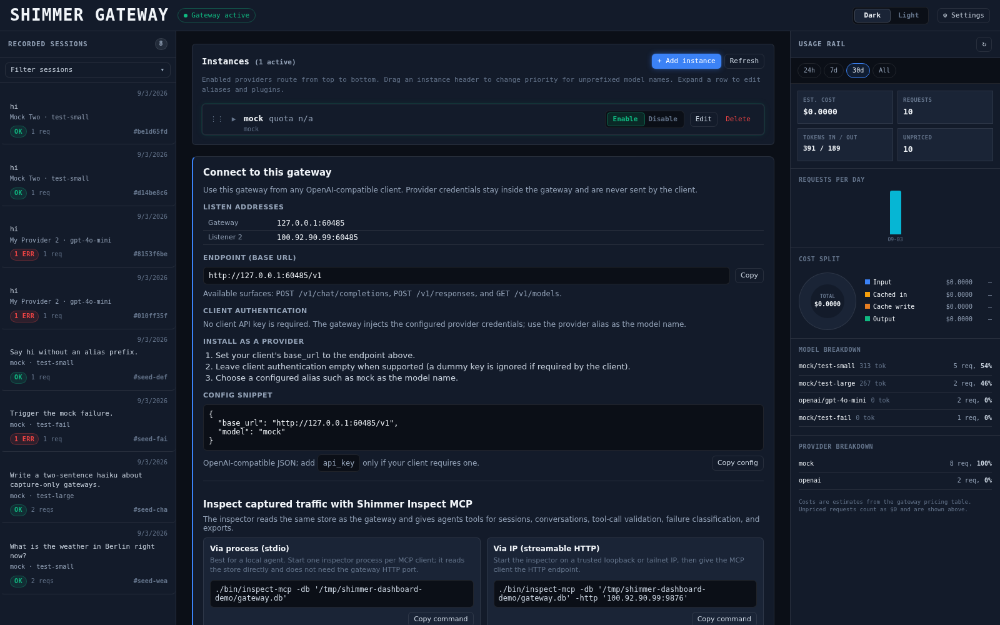

# Shimmer LLM Gateway

  

Shimmer is a capture-only, OpenAI-compatible LLM gateway. It proxies chat
completions and the Responses API, records requests and responses to SQLite,
and provides a dashboard plus an MCP inspector for exploring captured traffic.

The screenshot above shows the current dashboard, including the gateway setup,
usage view, and MCP inspector setup.

## Install

Requirements:

- Go 1.26 or newer
- [just](https://github.com/casey/just) is optional but provides the project
  shortcuts
- `openssl` is recommended for generating the secrets-encryption key

Clone the repository, create a configuration file, and build both binaries:

~~~bash
git clone https://github.com/amirzamli/shimmer-llmgateway.git
cd shimmer-llmgateway
cp gateway.toml.example gateway.toml

just build
~~~

Without `just`:

~~~bash
mkdir -p bin
CGO_ENABLED=0 go build -o bin/gateway ./cmd/gateway
CGO_ENABLED=0 go build -o bin/inspect-mcp ./cmd/inspect-mcp
~~~

The build is static and does not require CGO.

## Configure and run

Set the provider key in the environment and create a master key before the
first run:

~~~bash
export OPENAI_API_KEY="your-provider-key"
export SHIMMER_MASTER_KEY="$(openssl rand -base64 32)"

./bin/gateway -config gateway.toml
~~~

The gateway listens on `http://127.0.0.1:8787` by default. API keys do not go
in `gateway.toml`; the gateway reads the environment variable named by
`api_key_env` and stores UI-managed keys in an encrypted secrets file.

The example configuration contains OpenAI and Ollama providers. A provider
template and one concrete instance look like this:

~~~toml
[providers.openai]
base_url = "https://api.openai.com/v1"
api_key_env = "OPENAI_API_KEY"
models = ["gpt-4o", "gpt-4o-mini"]

[[instances]]
alias = "openai"
template = "openai"
api_key_env = "OPENAI_API_KEY"
~~~

If you prefer the smaller starter configuration, run this instead of copying
the example:

~~~bash
just init
~~~

Pricing data is optional. It powers the dashboard's cost estimates:

~~~bash
just update-prices
~~~

## Use the gateway

Point an OpenAI-compatible client at:

~~~text
http://127.0.0.1:8787/v1
~~~

For example:

~~~bash
curl http://127.0.0.1:8787/v1/chat/completions \
  -H 'Content-Type: application/json' \
  -d '{"model":"openai/gpt-4o","messages":[{"role":"user","content":"Hello"}]}'
~~~

Model names can be prefixed with an instance alias (`openai/gpt-4o`) or left
unprefixed when the gateway can resolve them through the default instance.
Client credentials are ignored; provider credentials stay inside the gateway.

The gateway supports:

- `POST /v1/chat/completions`, streamed and non-streamed
- `POST /v1/responses`, streamed and non-streamed
- the embedded dashboard for providers, sessions, traces, usage, and settings

See the configuration comments and source packages for deeper routing and
protocol details.

## Inspect captures with MCP

The MCP inspector is a first-class part of Shimmer. It reads the same SQLite
store as the dashboard and exposes captured conversations and tool-call
analysis to agents. The gateway may be stopped while you inspect existing
data; it only needs to be running when new traffic is being captured.

Build it with `just build`, then run the default stdio transport:

~~~bash
./bin/inspect-mcp -db "$PWD/gateway.db"
~~~

### OpenCode

Add the inspector to `opencode.json` and restart OpenCode:

~~~json
{
  "mcp": {
    "shimmer-inspect": {
      "type": "local",
      "command": [
        "/absolute/path/to/bin/inspect-mcp",
        "--db",
        "/absolute/path/to/gateway.db"
      ]
    }
  }
}
~~~

### Claude Desktop or Cursor

Use the same executable and database paths in the client's `mcpServers`
configuration:

~~~json
{
  "mcpServers": {
    "shimmer-inspect": {
      "command": "/absolute/path/to/bin/inspect-mcp",
      "args": ["--db", "/absolute/path/to/gateway.db"]
    }
  }
}
~~~

The inspector provides tools for listing sessions, replaying conversations,
reading raw requests, searching captures, exporting sessions, checking
gateway status, listing tool calls, validating tool arguments, and classifying
failures. Use `-session <id>` to scope generic inspection tools to one session.

For streamable HTTP instead of stdio:

~~~bash
./bin/inspect-mcp \
  -db "$PWD/gateway.db" \
  -http 127.0.0.1:9876
~~~

The endpoint is `http://127.0.0.1:9876/mcp`. Bind it only to a trusted
loopback or tailnet address; the MCP HTTP transport has no authentication or
CORS layer.

## Providers and data

- `[providers.<name>]` defines a reusable provider template.
- `[[instances]]` defines a concrete account and its alias.
- `alias/model` selects a specific instance; routing priority and model aliases
  are supported.
- Captures are stored in `gateway.db`; the append-only export is
  `gateway.db.jsonl`.
- Payloads are purged according to `retention_days` while usage metadata
  remains.
- UI-managed API keys are encrypted in `gateway.db.secrets.json` using
  `SHIMMER_MASTER_KEY`. Keep that key safe: it cannot be recovered from the
  database.

Shimmer is intended for local development and trusted tailnets, not as a
public multi-user service.

## Development

~~~bash
just fmt
just vet
just test
just run-test
~~~

The UI is the single file [web/index.html](web/index.html); it is served
directly from the working tree during development. `just run-test` starts an
isolated gateway with seeded captures and a mock provider.

## License

MIT — see [LICENSE](LICENSE).
