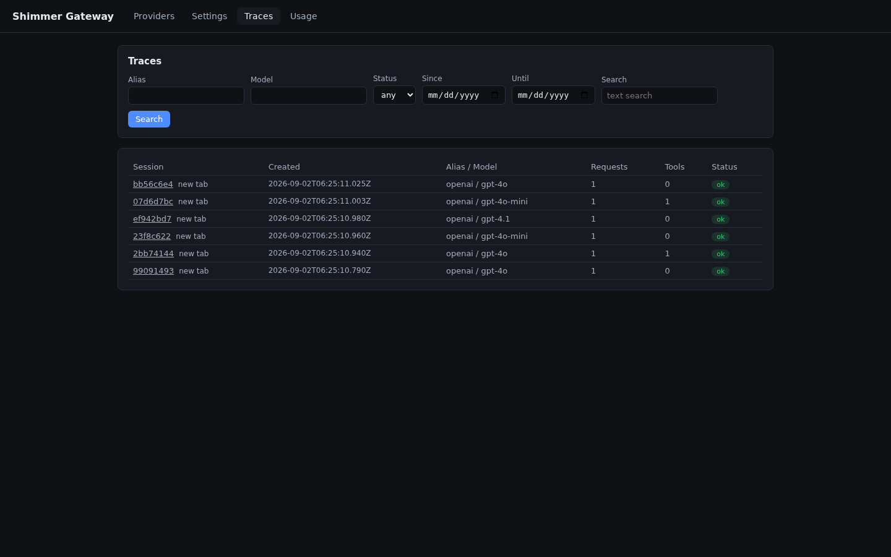
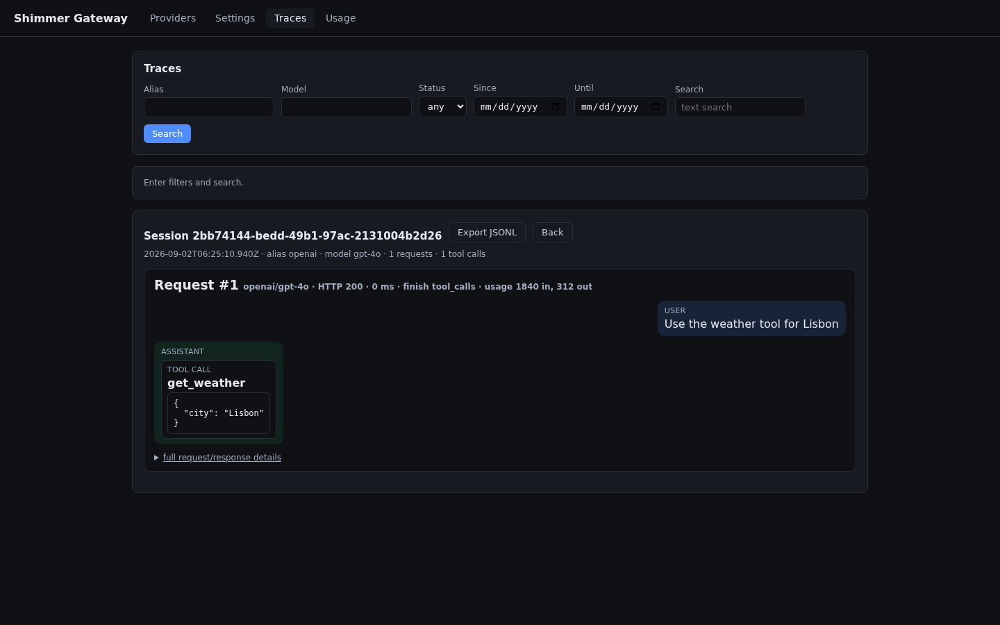
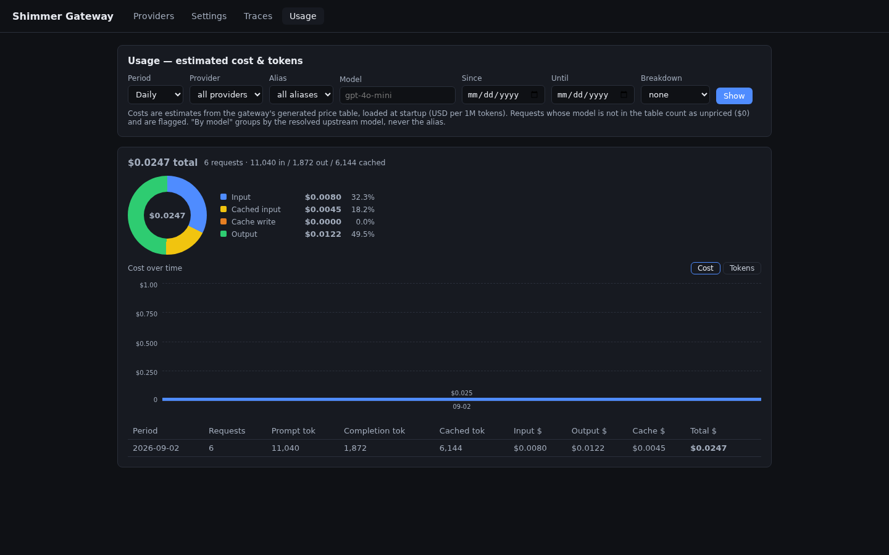

# Shimmer LLM Gateway

A capture-only LLM gateway in a single static Go binary: it proxies OpenAI-compatible
chat completions plus the OpenAI Responses API (stream and non-stream), recording
every request and response full-fidelity to SQLite. An embedded UI manages providers,
instances, and traces; a separate MCP inspection server exposes captured traffic to agents.

  

[](https://github.com/amirzamli/shimmer-llmgateway/actions/workflows/ci.yml) [](https://go.dev) [](LICENSE) [](https://goreportcard.com/report/github.com/amirzamli/shimmer-llmgateway)

## Requirements

- **Go 1.26+** — no CGO needed (the build uses modernc.org/sqlite).
- [just](https://github.com/casey/just) (optional) — task shortcuts; network access is needed for `just update-prices` (downloads the models.dev pricing catalog).

## Quick start

```bash
just build                          # 1. writes bin/gateway + bin/inspect-mcp
just update-prices                  # 2. writes internal/pricing/models.json (Usage view)
./bin/gateway -config gateway.toml  # 3. serves http://127.0.0.1:8787

# 4. point an OpenAI-compatible client at it
curl http://127.0.0.1:8787/v1/chat/completions \
  -H 'Content-Type: application/json' \
  -d '{"model":"openai/gpt-4o","messages":[{"role":"user","content":"hi"}]}'

./bin/inspect-mcp -db gateway.db    # 5. inspect what was captured (MCP over stdio)
```

Without just: `mkdir -p bin && go build -o bin/gateway ./cmd/gateway && go build -o bin/inspect-mcp ./cmd/inspect-mcp`. Everything captured lands in the SQLite store (`gateway.db` by default); the UI and the MCP server both read that same store.

## Configuration

```toml
listen_addrs = ['127.0.0.1:8787']   # loopback / CGNAT / ULA only
store  = 'gateway.db'
retention_days = 7                  # default when unset; <= 0 disables

[providers.openai]                  # TEMPLATE: the dropdown entry
base_url = 'https://api.openai.com/v1'
api_key_env = 'OPENAI_API_KEY'
models = ['gpt-4o', 'gpt-4o-mini']
[[instances]]                       # INSTANCE of openai — alias defaults to "openai"
alias = 'openai'
template = 'openai'
api_key_env = 'OPENAI_API_KEY'
```

Key rules:

- **Templates vs instances.** `[providers.<name>]` are templates (built-ins ship for openai, anthropic, ollama, groq, vllm, lite_llm, and more); `[[instances]]` are concrete accounts of a template, each with an alias (`openai`, `openai-2`, …).
- **Alias routing.** A model named `alias/model` routes to that instance; unprefixed names resolve via `settings.default_alias`, then the first enabled instance listing the model.
- **API keys never live in `gateway.toml`.** They come from the `api_key_env` environment variable or the UI-managed secrets file (see [Security](#security)); the gateway injects the resolved key, so clients need none.
- **Session-requiring upstreams.** Templates may declare a `session_header` (the built-in `opencode_go` sets `x-opencode-session`): the gateway then sends the request's effective session id — the client's `X-Session-Id` when present, else a generated UUID, echoed back as `X-Gateway-Session-Id` — in that header on every upstream call. OpenCode Go rejects requests without it (HTTP 400 `MissingSessionID`), so routing deepseek/other models through the `opencode_go` instance requires it.
- **Hot config write-back.** Config mutations through the UI/REST API are written back to `gateway.toml` and applied atomically to the next request — no restart. The file is rewritten wholesale (comments and formatting are not preserved).
- **`model_aliases`.** Per-instance map of friendly names to concrete models (`small = 'gpt-4o-mini'`); keys (like instance aliases) match `[A-Za-z0-9_.-]+` with interior single spaces allowed (e.g. `'My Provider'`), values are non-empty model strings (slashes allowed). Matching is case-sensitive.
- **`listen_addrs`.** Only loopback (`127.0.0.0/8`, `::1`, `localhost`), CGNAT (`100.64.0.0/10`, the Tailscale default range), and ULA (`fc00::/7`) are accepted; wildcard and LAN addresses are refused at startup.

Details — see [docs/gateway-spec.md](docs/gateway-spec.md) for the full protocol spec:

- **Plugin resolution.** A per-instance `plugins` list overrides the global `settings.request_plugins` / `settings.response_plugins` (no `plugins` line → global settings, empty by default = off); a template-level `plugins` list is a materialization seed recorded into instances without their own line on config write-back — spec §4.5. Per-provider toggles live in the dashboard: each provider's Plugins row has an "inherit global defaults" switch plus a checkbox per plugin, saved straight to the instance's list (`PATCH /api/instances/{alias}` with `plugins` or `plugins_inherit`).
- **Instance priority.** `priority = <n>` reorders unprefixed-name routing: a lower value wins, any explicit value beats instances without one (which keep file order), prefixed routing is unaffected; `0` or an absent line means unset. Editable in the UI per instance.
- **Model aliases.** Expansion is single-level (mapped values are never re-expanded), an alias key shadows literal model membership, and a prefixed name expands only when it is a key of that instance's map — spec §4.2.
- **Usage & costs.** Costs are estimates computed at capture time from the request's real token usage times the generated price table (`internal/pricing/models.json`); unpriced models count $0 and are flagged, and a fresh checkout has no table until you run `just update-prices` (cost estimation stays off until then). Surface: `GET /api/usage` + the Usage tab.
- **Provider model fetching.** The dashboard's model dropdown fetches `GET <base_url>/models`, cached in-memory for 5 minutes (`?refresh=1` bypasses; a PATCH/DELETE invalidates); on fetch failure the configured models are returned — spec §6.2.
- **Retention.** Payloads older than `retention_days` are expired by a background loop (a catch-up pass right after startup, then daily) — purging never blocks serving or shutdown; session/request rows stay as metadata (timestamps, model, status, token counts, costs) and expired sessions are flagged `expired`.

## Clients

Point any OpenAI-compatible client at `http://127.0.0.1:8787/v1` and request any configured `alias/model` (or unprefixed, resolved via `default_alias`); no auth header needed. `/v1/chat/completions` and `/v1/responses` are proxied (stream + non-stream); any other `/v1/*` path returns 404 (including `GET /v1/responses/{id}` — the Responses shim is stateless).

opencode — add a custom provider in `opencode.json` (project or `~/.config/opencode/opencode.json`), then **restart opencode**:

```jsonc
{
  "$schema": "https://opencode.ai/config.json",
  "provider": {
    "shimmer": {
      "npm": "@ai-sdk/openai-compatible",
      "name": "Shimmer Gateway",
      "options": { "baseURL": "http://127.0.0.1:8787/v1", "apiKey": "gateway" },
      "models": {
        "openai/gpt-4o":   { "name": "gpt-4o (openai account)" },
        "openai-2/gpt-4o": { "name": "gpt-4o (openai-2 account)" },
        "ollama/llama3.1": { "name": "llama3.1 (ollama)" }
      }
    }
  },
  "model": "shimmer/openai/gpt-4o"
}
```

- `apiKey` is a dummy — the gateway ignores client credentials and injects the real key; model ids are the routing key: `openai/gpt-4o` → instance `openai`, model `gpt-4o`; any id `GET /v1/models` lists is routable (`shimmer/small` for an unprefixed alias).

### Codex CLI (Responses API)

Codex CLI speaks the OpenAI Responses API; the gateway serves `POST /v1/responses` as a stateless shim over the same chat pipeline (any openai- or anthropic-style instance works — requests are translated upstream, replies are translated back). Point it at the gateway in `~/.codex/config.toml`:

```toml
model_provider = "shimmer"
model = "openai/gpt-4o"

[model_providers.shimmer]
name = "Shimmer Gateway"
base_url = "http://127.0.0.1:8787/v1"
wire_api = "responses"
```

Streamed turns emit the typed Responses SSE events (`response.created`, per-item `response.output_item.*` deltas, `response.completed` with usage); upstream reasoning/thinking deltas surface as a `reasoning` output item. Stateless by design: `previous_response_id` is rejected with a 400, `GET /v1/responses/{id}` always 404s, and `store` / `include` / `metadata` / `reasoning.summary` are accepted and ignored. Only function tools are forwarded upstream (other tool types are skipped with a warn log); input `reasoning` items are dropped, and reasoning is surfaced from upstream deltas on output only. Capture stores the as-received Responses request and the chat-normalized response; sessions group by `prompt_cache_key` when the client sends no `X-Session-Id`. When response plugins are configured for the instance, the whole streamed event sequence is emitted as one burst after the plugins run.

## MCP inspection server

`./bin/inspect-mcp -db <path> [-session <id>] [-http <addr>]`: `-db` (required) is the gateway SQLite store, `-session` scopes the tools to one session, `-http <addr>` serves streamable-http (`POST /mcp`) instead of stdio. The server reads the store directly — the gateway need not run to inspect, but must run to capture new traffic.

Install in agents — opencode (`opencode.json`), then **restart opencode**:

```jsonc
{
  "$schema": "https://opencode.ai/config.json",
  "mcp": {
    "shimmer-inspect": {
      "type": "local",
      "command": ["/abs/path/to/bin/inspect-mcp", "--db", "/abs/path/to/gateway.db"]
    }
  }
}
```

Claude Desktop and Cursor use the same `mcpServers` JSON shape (`command` + `args`). All tools return JSON text, never throw, and report errors as `{errorCode, message}`:

| Tool | Purpose |

## Security

A **localhost developer tool**, not a hardened multi-user service — not designed to be exposed to untrusted networks. Shipped hardening:

- **Binding policy.** The gateway refuses to bind anything but loopback, CGNAT (`100.64.0.0/10`, the Tailscale default range), and ULA (`fc00::/7`); the secrets master-key endpoints additionally refuse non-loopback client sources.
- **Host/Origin validation.** The unauthenticated `/api/*` surface and the embedded UI only serve requests whose `Host` names an address the gateway actually serves, and reject cross-site `Origin` / `Sec-Fetch-Site` requests on state-changing methods (a web page cannot drive the admin API); `/v1/chat/completions` is not subject to these checks.
- **Secrets at rest.** Per-instance API keys live in `<store>.secrets.json` (mode `0600`), AES-256-GCM-encrypted under `SHIMMER_MASTER_KEY` — set a base64-encoded 32-byte key before first run, or acknowledge the one-time key the dashboard generates. **Losing the master key means the stored API keys cannot be recovered.**
- **No CORS on the MCP HTTP transport.** The `inspect-mcp` streamable-http endpoint sends no CORS headers, so browser pages cannot read captured traffic.
- **Retention.** Payloads older than `retention_days` are purged daily (plus a catch-up pass right after startup); only request metadata survives.

Threat model: a non-loopback `listen_addrs` entry makes the unauthenticated `/api/*` surface reachable from that network (on a tailnet, only its devices) while the master-key endpoints stay localhost-only; provider `base_url` is trusted configuration — the gateway validates the http(s) scheme and never follows redirects, but forwards to any configured http(s) host including private ones (ollama, vllm); API keys are encrypted at rest, so keep `SHIMMER_MASTER_KEY` secret and set it explicitly before first run.

Report security-sensitive issues privately via GitHub **private vulnerability reporting** on this repository (Security → Report a vulnerability) — never as a public issue.

## Development

- Common tasks: `just fmt` / `just vet` / `just test` / `just race` / `just build` / `just update-prices` — or plain `go test ./...`.
- **Per-worktree test gateway.** `just run-test` starts this checkout's gateway on a random free port (loopback plus the machine's Tailscale IP when available, so the UI is reachable from other tailnet devices) with an isolated state dir (`.run-test/<branch>/`: generated config, its own SQLite store, secrets, capture JSONL) and a mock OpenAI-compatible provider (`scripts/mockprovider`) — it seeds dummy conversations (tool round-trip, streaming, an upstream failure) through the real proxy path on first run, so nothing collides with a main running gateway. UI edits in the worktree are served live; `just run-test-seed` re-seeds, `just run-test-clean` wipes the state.
- **UI edit-and-refresh.** The UI is a single `web/index.html` with no build step. The gateway serves `web/index.html` from the working directory when it exists, so edits show up on browser refresh — no rebuild, no restart. Without that file (e.g. a bare binary install), the copy embedded at build time is served.
- The pricing table `internal/pricing/models.json` is generated (`just update-prices`, from the models.dev catalog) and is not tracked in git.

## License

MIT — see [LICENSE](LICENSE).
