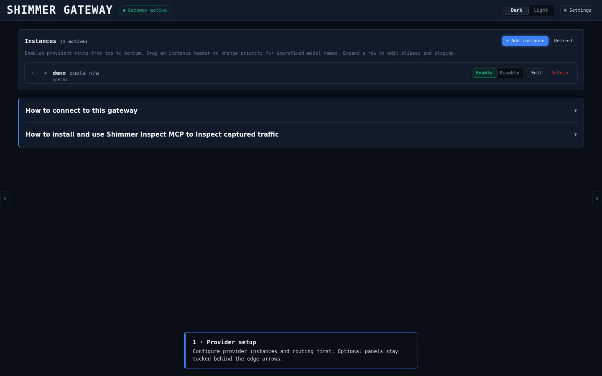

# Shim**mer, an LLM Gateway**

<p align="center">
  
</p>

**Shim**mer is an LLM gateway for easily switching between providers. I built it
because many coding harnesses don’t let you save multiple configurations for
the same provider. They can also make it difficult to see what’s actually being
sent to and received from an LLM.

Shimmer includes a few tools to make this easier:

- browse chat sessions and inspect raw API requests and responses for each message
- use the MCP inspect tool to let your agent look back at previous LLM requests and responses
- track cost/token usage over time

Cost estimates are approximate and may vary between providers.

## Setup
[](https://github.com/amirzamli/shimmer-llmgateway/actions/workflows/ci.yml)  [](https://go.dev) [](LICENSE)


Clone the repository:

```bash
git clone https://github.com/amirzamli/shimmer-llmgateway.git
cd shimmer-llmgateway
```

Provider API keys can be supplied in either of two ways: set the corresponding
environment variable, or add the key through the dashboard. You do not need to
set any provider environment variables to get started—skip this step and add
your provider keys from the dashboard after launching the gateway.

If you prefer environment variables, the built-in providers and their variable
names are summarized in [`gateway.toml.example`](gateway.toml.example). For
custom or overridden providers, use the `api_key_env` field. If you add the key
through the dashboard instead, you do not need to set or look up an environment
variable. For example:

```bash
export MISTRAL_API_KEY="your-provider-key"
# Optional, but recommended if you use UI-managed provider keys:
export SHIMMER_MASTER_KEY="$(openssl rand -base64 32)"
```

`SHIMMER_MASTER_KEY` is optional. If it is omitted, the gateway generates a key
on first run; set and keep the displayed key if you want UI-managed keys to
survive restarts.

### Running the gateway (without `just`)

```bash
cp gateway.toml.example gateway.toml
go run ./cmd/gateway -config gateway.toml
```

### Running the gateway with `just`
Utilizing the justfile is optional, it's my personal preference for collecting useful commands in one place.

```bash
just init
just run
```

No build step is required for either setup: `go run` and `just run` compile the
gateway as needed. The bare `just` target is a development aggregate that does
include a build. Use `go build` or `just build` only when you want reusable
binaries in `bin/` (including `inspect-mcp`); `just build` disables CGO.

## Use the gateway

The dashboard is at <http://127.0.0.1:8787>. Set an OpenAI-compatible client's
base URL to:

```text
http://127.0.0.1:8787/v1
```

Client API keys are not required; provider credentials stay inside the
gateway. A quick smoke test:

```bash
curl http://127.0.0.1:8787/v1/chat/completions \
  -H 'Content-Type: application/json' \
  -d '{"model":"mistral/mistral-large-latest","messages":[{"role":"user","content":"Hello"}]}'
```

Configure providers and instances in `gateway.toml` or from the dashboard.
[`gateway.toml.example`](gateway.toml.example) contains a minimal configuration
you can use as a starting point.

## ChatGPT Plus sign-in (OAuth)

The built-in `chatgpt` template routes to a ChatGPT Plus/Pro account through the
same browser sign-in flow the OpenCode agent uses — no API key is involved, and
the credential never leaves the gateway. Adding an instance of this template
from the dashboard opens the provider login in your browser and stores the
resulting credential encrypted next to your API keys.

Prerequisites:

- The gateway binds a fixed loopback callback listener on
  `localhost:1455` (the verified redirect contract). Keep that port free and
  local; the callback never listens on a remote address. If the port is
  already taken, gateway startup fails rather than starting without a working
  sign-in callback.
- Complete the sign-in in a browser that can reach the dashboard
  (<http://127.0.0.1:8787>) and the callback listener on `localhost:1455`.
- When using a configured Tailscale listener from another machine, the OAuth
  API accepts that listener, but the verified provider redirect remains
  `localhost:1455`. Forward that port to the gateway first, for example
  `ssh -N -L 1455:127.0.0.1:1455 user@gateway-host`.

Flow:

1. Dashboard → **+ Add instance** → template **chatgpt** → **Add instance**.
2. Expand the instance → **Sign in with ChatGPT**. The dashboard opens the
   provider's authorization page in a new tab.
3. Log in with your ChatGPT Plus/Pro account and approve the access request.
4. The provider redirects the browser to `http://localhost:1455/auth/callback`;
   the gateway validates the transaction, exchanges the code, and shows a
   short confirmation page — close that tab and return to the dashboard.
5. The instance now shows **connected** with the masked account id and the
   access-token expiry. The built-in template intentionally does not ship a
   fixed model allowlist because codex model availability changes; route a
   currently supported model as `chatgpt/<model-id>`.

What happens afterwards:

- **Refresh**: access tokens are refreshed automatically with an expiry skew;
  rotated tokens are persisted in the same encrypted secrets file as API keys
  (`<store>.secrets.json`, mode 0600). A failed refresh surfaces as a
  sanitized authentication error — token material never appears in URLs, JSON,
  logs, or the dashboard.
- **Disconnect**: the dashboard's **Disconnect** button (or deleting the
  instance) drops the stored credential and retires any in-flight sign-in;
  the instance itself stays configured and can be reconnected anytime. There
  is no separate provider-side revocation call.
- **API keys**: OAuth instances never take an API key — the key field is
  hidden for the `chatgpt` template, and the ordinary API-key providers keep
  their existing forms and behavior unchanged.

Routes used by the flow (behind the admin host/origin guard; lifecycle routes
also require a loopback TCP source or an explicitly configured listener):

| Method | Route | Purpose |
| --- | --- | --- |
| POST | `/api/instances/{alias}/oauth/start` | mint a short-lived, single-use sign-in transaction and return the provider authorization URL |
| POST | `/api/instances/{alias}/oauth/device/start` | start device-code sign-in and return the OpenAI device URL plus user code |
| GET | `/api/instances/{alias}/oauth/device/status` | poll device-code approval and complete the server-side token exchange |
| GET | `/api/instances/{alias}/oauth/status` | connection state: masked account id and token expiry, or `connected: false` |
| DELETE | `/api/instances/{alias}/oauth` | disconnect (idempotent; credential only, the instance stays) |
| GET | `/auth/callback` | fixed loopback-only callback served only at `http://localhost:1455/auth/callback` |

## MCP inspector (optional)

Inspect captures from the same SQLite store with:

```bash
go run ./cmd/inspect-mcp -db gateway.db
```

The equivalent Just command is `just mcp db=gateway.db`. For streamable HTTP,
add `-http 127.0.0.1:9876` (or use `just mcp-http`); keep that endpoint on a
trusted network because it has no authentication.

Captures are stored in `gateway.db`. UI-managed keys are stored encrypted in
`gateway.db.secrets.json`; keep `SHIMMER_MASTER_KEY` safe. Shimmer is intended
for local development and trusted tailnets, not as a public service.

## Development

```bash
go test ./...
```

With `just`, common commands are `just fmt`, `just vet`, `just test`, and
`just run-test`.

## License

MIT — see [`LICENSE`](LICENSE).
